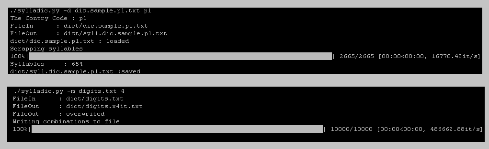
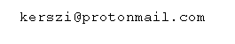

# Sylladic



## Table of contents
* [General info](#general-info)
* [Technologies](#technologies)
* [Setup](#setup)
* [How to use](#How-to-use)
* [Contact][#Contact]

## General info
Sylladic is a program which helps you to create dictionaries. A dictionary is made up of words and converted into syllables (thanx 4 great pyphen library) 


Why I made it?

I forgot a password, but I know it was non-dictionary and consisted of Polish syllables. This word was not in the regular dictionary. Unfortunately, I couldn't find the syllable dictionary, so I wrote a program to create it. When you create the dictionary, you can multiply syllables and other chars from file. 
	
## Technologies
* Python 3.x

## Libraries
Project is created with great libraries:

* Pyphen 
* Tqdm
* Pathlib
* Argparse
* Itertools


	
## Setup
To run this project, download and install it locally:
```
$ sudo git clone https://github.com/kerszl/sylladic
$ cd sylladic
$ pip3 install -r requirements.txt
$ chmod +x sylladic.py
```

## How to use
When you want create syllables from dictionary:
```
$ ./sylladic.py -d dic.sample.pl.txt pl
```
* dic.sample.pl.txt - file with dictionary (must be in "dict" directory)
* pl - contry code


When you want multiply syllables or other chars:
```
$ ./sylladic.py -m digits.txt 4
```
* digits.txt - file to multiply chars
* 4 - how many times multiply


You can see simple iterations graph:
```
$ ./sylladic.py -g
```
## Contact

